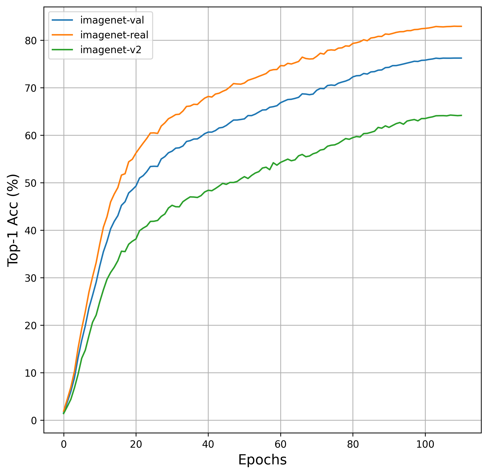

# Experiments with `big_vision`

Contains my experiments with the [`big_vision`](https://github.com/google-research/big_vision) repository to train ViTs on ImageNet-1k.

## What is `big_vision`?

From the repository:

> This codebase is designed for training large-scale vision models on Cloud TPU VMs. It is based on Jax/Flax libraries, and uses tf.data and TensorFlow Datasets for scalable input pipelines in the Cloud.

> big_vision aims to support research projects at Google. We are unlikely to work on feature requests or accept external contributions, unless they were pre-approved (ask in an issue first). 

## Why this repository?

* I really like how `big_vision` is organized into composable modules.
* I wanted to reproduce some of the ImageNet-1k results reported by the `big_vision` authors.
* `big_vision` not only reports scores for ImageNet-1k validation set but also reports
scores for ImageNet-V2 and ImageNet-Real.
* I wanted to run the entire training using Cloud TPUs and at the same time I wanted to 
improve my JAX skills.
* I wanted to improve my chops in large-scale pre-training. Large-scale pretraining is a goldmine of
deep learning that continues to benefit downstream applications. Programs like [TRC](https://sites.research.google/trc) make it possible for
the community to learn the nitty-gritty of large-scale pre-training by providing
TPU support.
* For the sheer joy of training models to SoTA.

This repository will also contain the trained checkpoints and the training logs. Additionally, 
this Colab Notebook ([`notebooks/analyze-metrics.ipynb`](https://colab.research.google.com/github/sayakpaul/big_vision_experiments/blob/main/notebooks/analyze-metrics.ipynb)) takes the raw training logs and generates a plot for reporting accuracies
across three benchmarks: ImageNet-1k validation set, ImageNetV2, ImageNet-Real.

Here's one such plot I generated from ViT S/16 checkpoints (that get to 76.23% top-1 accuracy on ImageNet-1k validation set within 90 epochs of training):

Training was performed on a TPU v3-8 VM that took 7 hours 22 minutes to complete.
 
## Checkpoints and training logs

* [`vit_s16_imagenet_1k`](https://github.com/sayakpaul/big_vision_experiments/releases/tag/v0.1.0)

## Setup

Even though the `big_vision` repository provides instructions for setting things up I found them a bit incomplete.
Hence, I developed another one. Find it here - [`setup.md`](https://github.com/sayakpaul/big_vision_experiments/blob/main/setup.md).

## Acknowledgements

* [TRC (TPU Research Cloud)](https://sites.research.google/trc) for providing TPU access.
* [ML-GDE program](https://developers.google.com/programs/experts/) for providing GCP credits.
